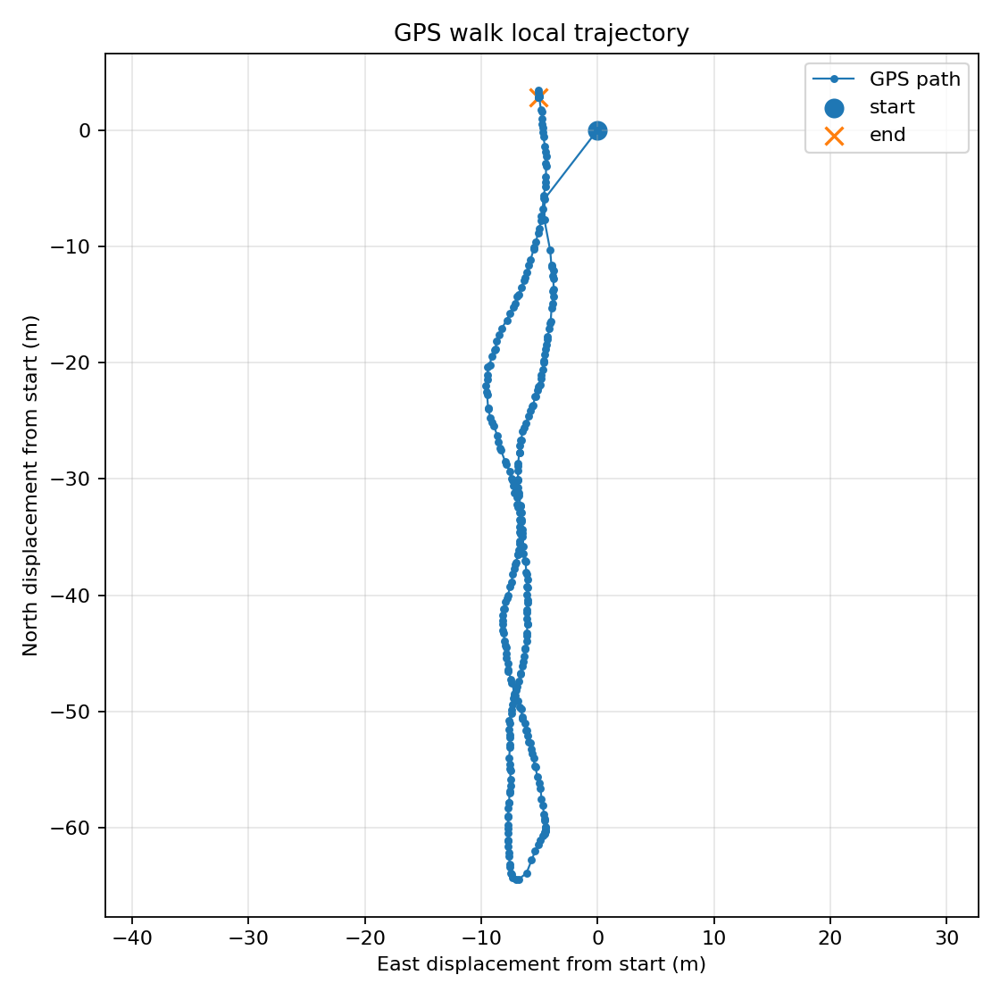
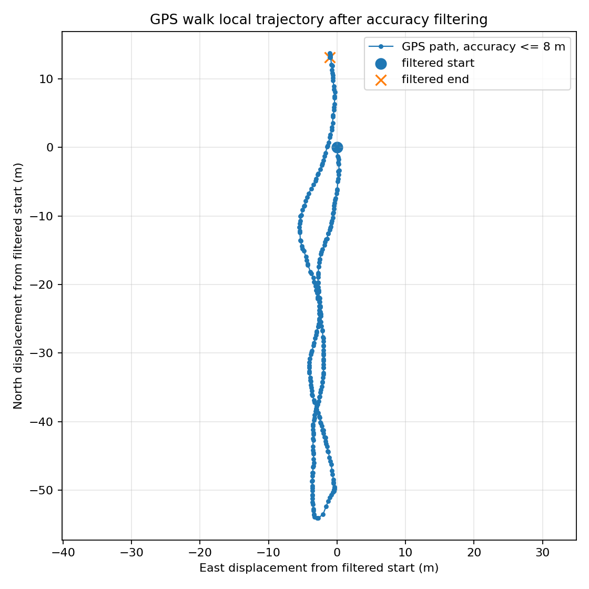
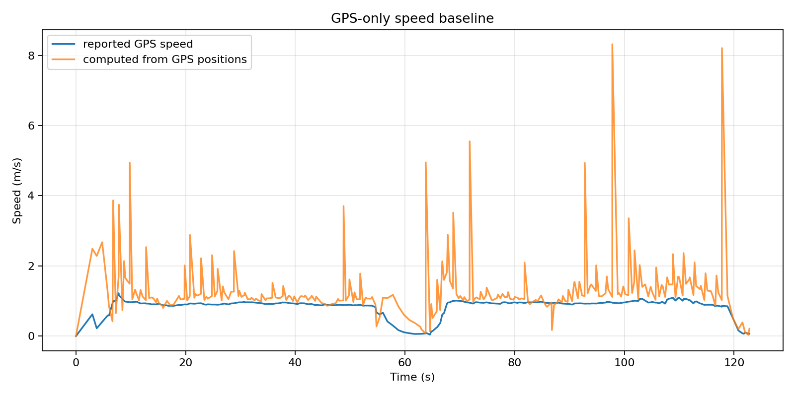
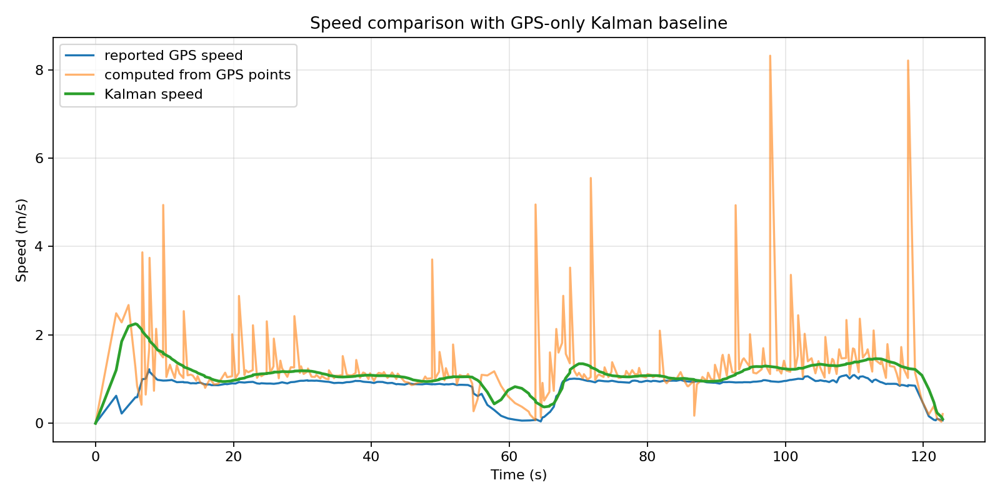
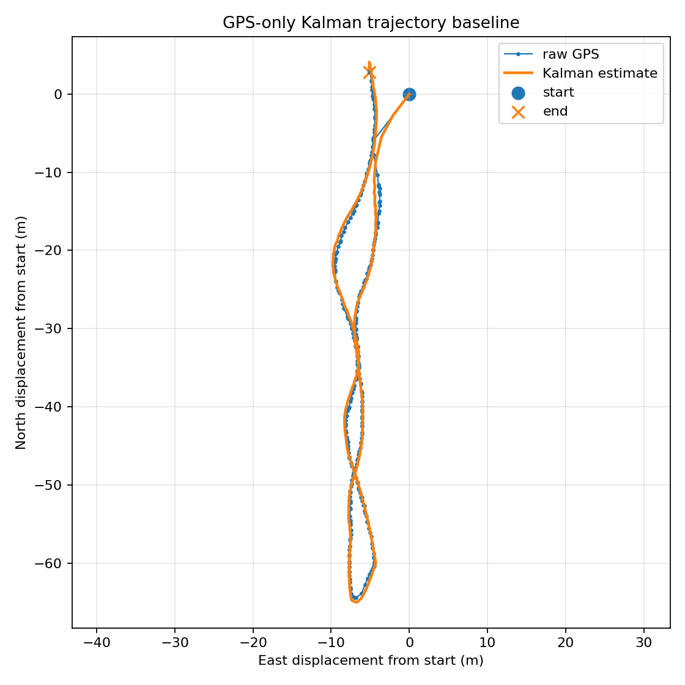
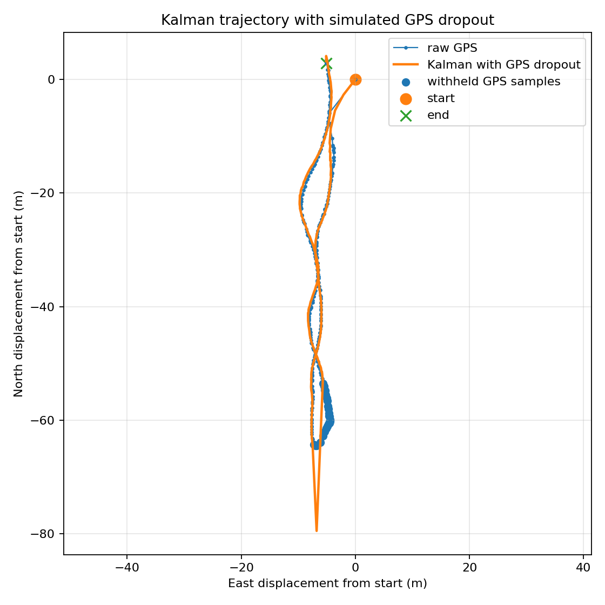
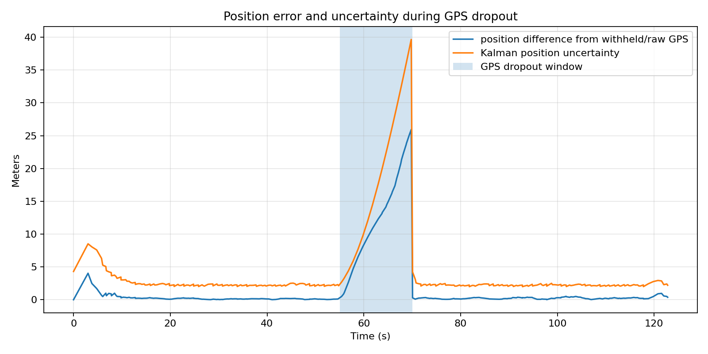
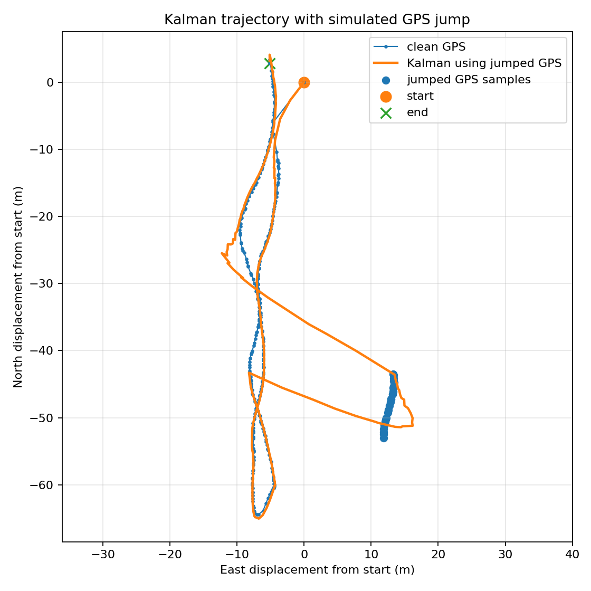
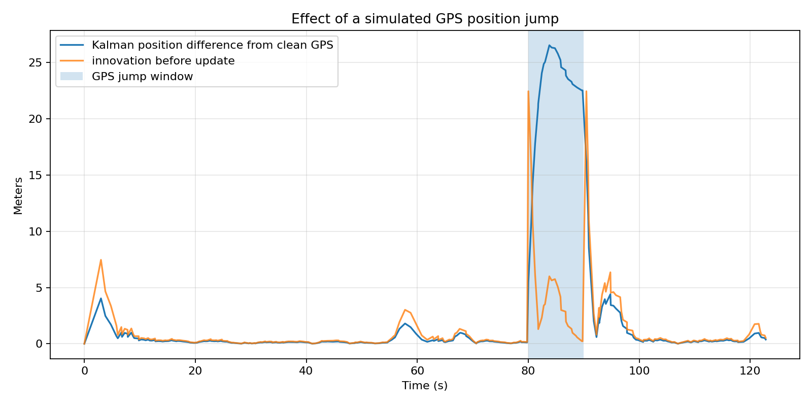

# Adaptive Mobile Navigation Fusion

Phone GPS is noisy enough that a straight walk does not always look straight on a plot.

This project uses real phone-collected GPS/IMU logs to build a small navigation-estimation pipeline. The first milestone is a GPS-only baseline, followed by a simple Kalman filter for 2D motion.

## Current results

| Experiment | Duration | Samples | Main result |
|---|---:|---:|---|
| Room IMU sanity check | 35.6 s | ~3.5k per IMU stream | Phone accelerometer, gyroscope, orientation, compass, and total acceleration logs were readable at about 100 Hz. |
| Short GPS walk | 34.2 s | 68 GPS samples | Short paths are strongly affected by early GPS error. |
| Longer GPS walk | 122.8 s | 283 GPS samples | The out-and-back walking path is visible and usable for a first baseline. |
| GPS-only baseline | 122.8 s | 283 GPS samples | Point-to-point GPS speed has unrealistic spikes up to about 8.3 m/s. |
| Kalman baseline | 122.8 s | 283 GPS samples | Kalman speed stays more realistic, with max speed around 2.25 m/s and median speed around 1.09 m/s. |
| GPS dropout simulation | 122.8 s | 283 GPS samples | During a simulated 55-70 s GPS outage, the prediction-only Kalman estimate drifts up to about 25.9 m from GPS before recovering after GPS updates return. |
| GPS jump simulation | 122.8 s | 283 GPS samples | A simulated 22.4 m GPS position jump pulls the simple Kalman estimate away from the clean path, with position error reaching about 26.5 m. |

## Longer GPS walk

The second outdoor walk is the first useful navigation log in this repository. The phone GPS had a median horizontal accuracy of about 3.0 m.

The filtered view removes the worst low-accuracy GPS fixes.

## GPS-only baseline

The public baseline file does not store raw latitude or longitude. It keeps local east/north coordinates relative to the starting point, plus distance, speed, and GPS accuracy fields.

The GPS-only baseline shows the main problem clearly: computing speed directly from consecutive GPS points creates sharp spikes.

## Kalman baseline

A simple constant-velocity Kalman filter was added with state:

`[x, y, vx, vy]`

The filter does not solve the full navigation problem yet, but it reduces the worst GPS-derived speed spikes. In this run, the maximum raw computed GPS speed was about 8.3 m/s, while the maximum Kalman speed was about 2.25 m/s.

The estimated trajectory still follows the same general out-and-back path.

## GPS dropout simulation

To test navigation robustness, I simulated a GPS outage from 55 s to 70 s on the longer walk. During that window, the Kalman filter keeps predicting motion but does not use GPS position updates.

The result is expected: uncertainty grows during the outage, and the estimate drifts away from the withheld GPS samples. In this run, the largest position difference during dropout was about 25.9 m. Once GPS updates return, the filter quickly moves back toward the measured path.

The uncertainty plot makes the failure mode easier to see than the trajectory plot alone.

## GPS jump simulation

Dropout is one failure mode. A different problem is bad GPS that still looks like a valid measurement. To test that case, I injected a 20 m east and -10 m north offset from 80 s to 90 s.

The simple Kalman filter follows the corrupted GPS instead of rejecting it. In this run, a 22.4 m injected GPS jump caused the Kalman position error to reach about 26.5 m relative to the clean GPS path. When the GPS returns to the clean path, the filter recovers, but the speed estimate briefly spikes.

The error plot shows why a plain Kalman filter is not enough for GPS fault handling. A next step would be innovation gating or a GPS reliability score before accepting position updates.

## Generated outputs

Main result files:

- `results/gps_walk_02_gps_baseline.csv`
- `results/gps_walk_02_gps_baseline_summary.csv`
- `results/gps_walk_02_kalman_baseline.csv`
- `results/gps_walk_02_kalman_baseline_summary.csv`
- `results/gps_walk_02_dropout_kalman.csv`
- `results/gps_walk_02_dropout_kalman_summary.csv`
- `results/gps_walk_02_jump_kalman.csv`
- `results/gps_walk_02_jump_kalman_summary.csv`

Main scripts:

- `src/plot_sensor_log.py`
- `src/plot_gps_walk.py`
- `src/build_gps_baseline.py`
- `src/run_kalman_gps_baseline.py`
- `src/simulate_gps_dropout.py`
- `src/simulate_gps_jump.py`

## Planned direction

Next steps:

- compare GPS-only smoothing against Kalman filtering
- add outlier rejection or innovation gating for GPS jumps
- use IMU-derived features for sensor reliability checks
- build an adaptive fusion experiment

## Limitations

- phone GPS is not ground truth
- phone IMU orientation is not fixed to a robot body frame
- the current Kalman filter uses GPS positions only
- the current test path is simple and mostly straight
- the dropout experiment is simulated from logged GPS data, not a live sensor failure
- the GPS jump experiment uses an injected offset, not a real spoofing device
- future tests should include turns, stops, and live controlled GPS dropout
