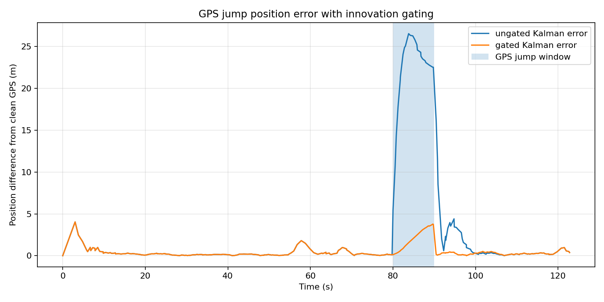
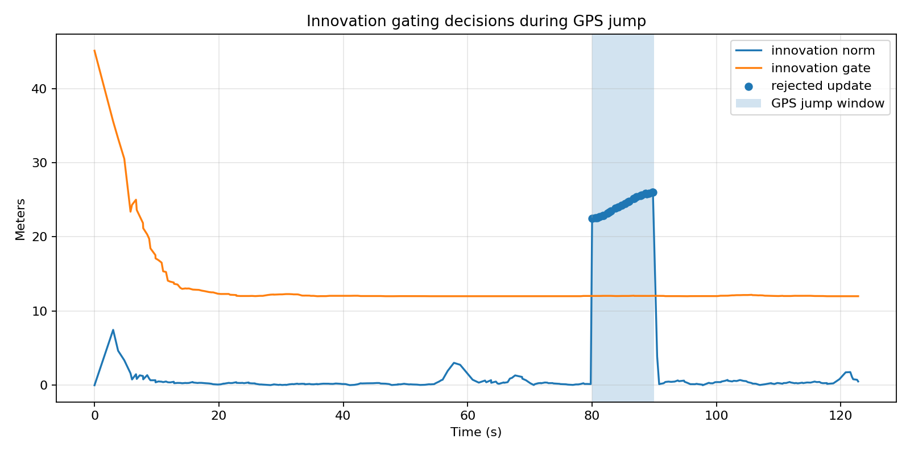
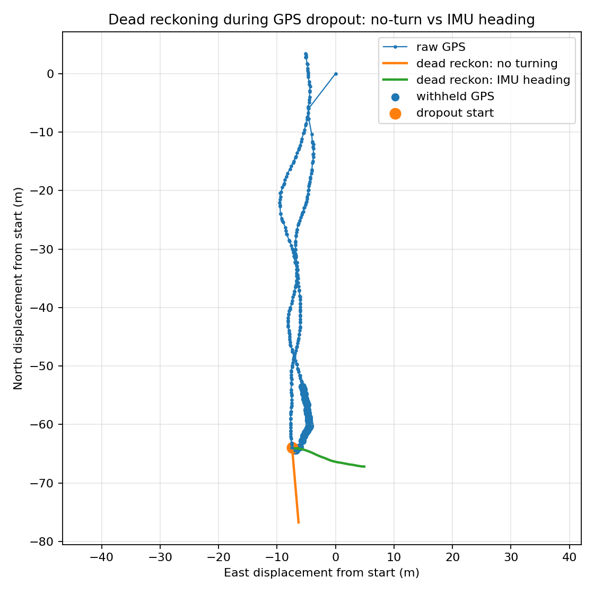
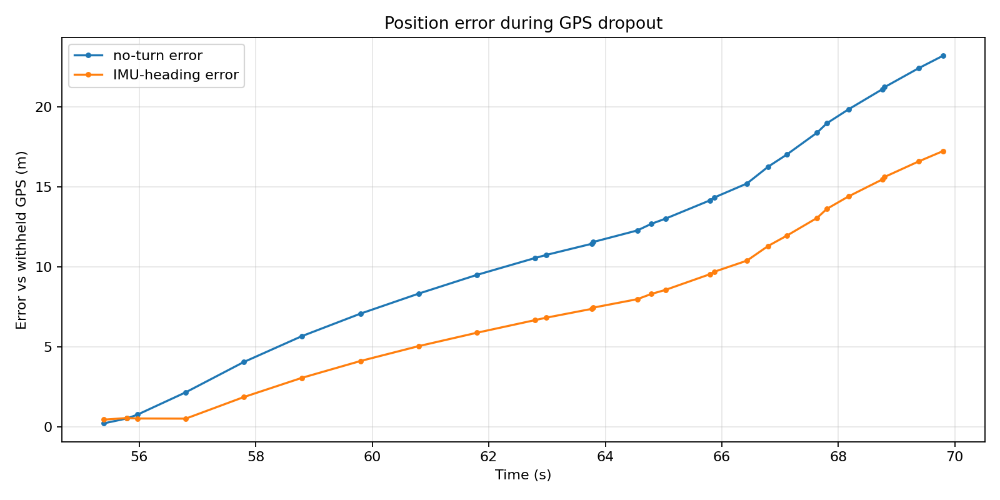

# Adaptive Mobile Navigation Fusion

Phone GPS is noisy enough that a straight walk does not always look straight on a plot.

This project uses real phone-collected GPS/IMU logs to build a small navigation-estimation pipeline. It starts from a GPS-only baseline and a simple 2D Kalman filter, then adds GPS fault tests and a first GPS/IMU step that uses the phone IMU to hold heading through a GPS outage.

## Current results

| Experiment | Duration | Samples | Main result |
|---|---:|---:|---|
| Room IMU sanity check | 35.6 s | ~3.5k per IMU stream | Phone accelerometer, gyroscope, orientation, compass, and total acceleration logs were readable at about 100 Hz. |
| Short GPS walk | 34.2 s | 68 GPS samples | Short paths are strongly affected by early GPS error. |
| Longer GPS walk | 122.8 s | 283 GPS samples | The out-and-back walking path is visible and usable for a first baseline. |
| GPS-only baseline | 122.8 s | 283 GPS samples | Point-to-point GPS speed has unrealistic spikes up to about 8.3 m/s. |
| Kalman baseline | 122.8 s | 283 GPS samples | Kalman speed stays more realistic, with max speed around 2.25 m/s and median speed around 1.09 m/s. |
| GPS dropout simulation | 122.8 s | 283 GPS samples | During a simulated 55-70 s GPS outage, the prediction-only Kalman estimate drifts up to about 25.9 m from GPS before recovering after GPS updates return. |
| GPS jump simulation | 122.8 s | 283 GPS samples | A simulated 22.4 m GPS position jump pulls the simple Kalman estimate away from the clean path, with position error reaching about 26.5 m. |
| GPS jump with innovation gating | 122.8 s | 283 GPS samples | A simple innovation gate rejects all 25 jumped GPS updates and reduces max jump-window error from about 26.5 m to about 3.8 m. |
| IMU-aided dropout dead reckoning | 122.8 s | 283 GPS samples | Over a simulated 55-70 s outage (28 withheld samples), adding IMU heading change to a constant-speed dead reckoning cut the max drift from about 23.2 m (no turning) to about 17.2 m, roughly 25.7% lower. |

## Longer GPS walk

The second outdoor walk is the first useful navigation log in this repository. The phone GPS had a median horizontal accuracy of about 3.0 m.

The filtered view removes the worst low-accuracy GPS fixes.

## GPS-only baseline

The public baseline file does not store raw latitude or longitude. It keeps local east/north coordinates relative to the starting point, plus distance, speed, and GPS accuracy fields.

The GPS-only baseline shows the main problem clearly: computing speed directly from consecutive GPS points creates sharp spikes.

## Kalman baseline

A simple constant-velocity Kalman filter was added with state:

`[x, y, vx, vy]`

The filter does not solve the full navigation problem yet, but it reduces the worst GPS-derived speed spikes. In this run, the maximum raw computed GPS speed was about 8.3 m/s, while the maximum Kalman speed was about 2.25 m/s.

The estimated trajectory still follows the same general out-and-back path.

## GPS dropout simulation

To test navigation robustness, I simulated a GPS outage from 55 s to 70 s on the longer walk. During that window, the Kalman filter keeps predicting motion but does not use GPS position updates.

The result is expected: uncertainty grows during the outage, and the estimate drifts away from the withheld GPS samples. In this run, the largest position difference during dropout was about 25.9 m. Once GPS updates return, the filter quickly moves back toward the measured path.

The uncertainty plot makes the failure mode easier to see than the trajectory plot alone.

## GPS jump simulation

Dropout is one failure mode. A different problem is bad GPS that still looks like a valid measurement. To test that case, I injected a 20 m east and -10 m north offset from 80 s to 90 s.

The simple Kalman filter follows the corrupted GPS instead of rejecting it. In this run, a 22.4 m injected GPS jump caused the Kalman position error to reach about 26.5 m relative to the clean GPS path. When the GPS returns to the clean path, the filter recovers, but the speed estimate briefly spikes.

The error plot shows why a plain Kalman filter is not enough for GPS fault handling. A next step would be innovation gating or a GPS reliability score before accepting position updates.

## GPS jump with innovation gating

The previous jump test showed a weakness: a plain Kalman filter trusts the corrupted GPS measurements. I added a simple innovation gate before the update step. If the GPS innovation is too large, the filter skips that measurement and keeps predicting.

With a 4-sigma gate and a minimum gate of 8 m, the filter rejected all 25 GPS updates during the injected jump window. The maximum jump-window position error dropped from about 26.5 m without gating to about 3.8 m with gating.

The gate decision plot shows the rejected updates during the artificial GPS jump.

## IMU-heading dead reckoning during GPS dropout

The earlier dropout test let the Kalman filter coast on its last velocity, and the estimate drifted about 25.9 m before GPS returned. That version has no way to know the person turned during the outage. This experiment asks a narrower question: if I hold the speed fixed but let the phone IMU tell me how the heading changed, how much of that drift goes away?

I rebuilt the outage as a dead-reckoning problem on the synced GPS+IMU table from milestone 1. At the last moving GPS sample before 55 s, I take the GPS course-over-ground as the starting heading and the mean speed over the previous 5 s (0.856 m/s) as a fixed speed. Across the 55-70 s window (28 withheld samples) I propagate position two ways, using the same speed and entry heading so the only difference is the turning:

- no turning: heading frozen at the entry value
- IMU heading: heading turned at each step by the change in `orientation_yaw`, not its absolute value

Using the change and not the absolute yaw comes straight from the milestone 2 heading check. GPS bearing, orientation yaw, and compass bearing each had a standard deviation near 30 deg on this walk, so no single one is a trustworthy absolute reference. The turn between two nearby samples is far more reliable than any one heading reading.

The no-turn baseline reached a max error of 23.19 m over the window. Adding the IMU heading brought it down to 17.23 m, about 25.7% lower. For both methods the error is largest at the very end of the window, which is what dead reckoning should do: drift keeps accumulating the longer GPS is gone.

One sign detail is worth recording. `heading_sign` is fixed at -1 because the device yaw increases clockwise while the East/North math angle increases counter-clockwise. I checked this once against the GPS course direction and then left it fixed. It is a frame relationship, not a value I tuned to make this walk look good.

This is still far from solved. 17 m is a large error to accept, and holding speed constant ignores that real walking speed changes across those 15 seconds. The next step is to feed the IMU turn rate into the filter as a control input instead of correcting heading after the fact, and to update speed from the accelerometer instead of holding it fixed.

## Generated outputs

Main result files:

- `results/gps_walk_02_gps_baseline.csv`
- `results/gps_walk_02_gps_baseline_summary.csv`
- `results/gps_walk_02_kalman_baseline.csv`
- `results/gps_walk_02_kalman_baseline_summary.csv`
- `results/gps_walk_02_dropout_kalman.csv`
- `results/gps_walk_02_dropout_kalman_summary.csv`
- `results/gps_walk_02_jump_kalman.csv`
- `results/gps_walk_02_jump_kalman_summary.csv`
- `results/gps_walk_02_jump_gated_kalman.csv`
- `results/gps_walk_02_jump_gating_comparison_summary.csv`
- `results/gps_walk_02_dropout_imu.csv`
- `results/gps_walk_02_dropout_imu_summary.csv`

Main scripts:

- `src/plot_sensor_log.py`
- `src/plot_gps_walk.py`
- `src/build_gps_baseline.py`
- `src/run_kalman_gps_baseline.py`
- `src/simulate_gps_dropout.py`
- `src/simulate_gps_jump.py`
- `src/compare_gps_jump_gating.py`
- `src/build_gps_imu_dataset.py`
- `src/inspect_heading_sources.py`
- `src/simulate_gps_dropout_imu.py`

## Planned direction

Next steps:

- feed the IMU turn rate into the filter as a control input, instead of correcting heading after the fact
- update speed from the accelerometer during dropout instead of holding it constant
- collect several synced walks so an adaptive or learned reliability model has enough data to be more than a fit to one walk
- test a softer GPS reliability score instead of a hard innovation gate

## Limitations

- phone GPS is not ground truth
- phone IMU orientation is not fixed to a robot body frame
- the current Kalman filter uses GPS positions only
- the current test path is simple and mostly straight
- the dropout experiment is simulated from logged GPS data, not a live sensor failure
- the GPS jump experiment uses an injected offset, not a real spoofing device
- the current innovation gate is a simple fixed-threshold rule, not an adaptive reliability model
- the IMU dead-reckoning experiment holds speed constant and only corrects heading, so it cannot follow real speed changes during the outage
- a 15 s outage is long for dead reckoning, and 17 m is still a large absolute error
- future tests should include turns, stops, and live controlled GPS dropout
